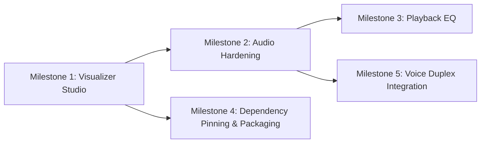

# 05 — NEXT DEVELOPMENT PLAN: E.V. Desktop Application

This document provides a prioritized, actionable implementation plan for the incoming developer/agent. Each task contains specific files, dependencies, acceptance criteria, and verification steps.

---

## 1. Immediate Blockers
None that prevent running or testing the application. The primary requirement is stabilizing and formalizing the in-progress multi-visualizer studio.

---

## 2. Milestone 1: Multi-Visualizer Studio Stabilization (High Priority)

### Task 1.1: Formalize & Commit Visualizer Trio Components
- **Objective**: Finalize the in-progress trio visualizers (`VisualizerBoard`, `CeilingRain`, `FlowTrace`, `SegmentStack`) and wire them seamlessly into `MusicWorkspace.qml`.
- **Files to Modify**:
  - `prototypes/cinematic_v4/qml/VisualizerBoard.qml`
  - `prototypes/cinematic_v4/qml/CeilingRain.qml`
  - `prototypes/cinematic_v4/qml/FlowTrace.qml`
  - `prototypes/cinematic_v4/qml/SegmentStack.qml`
  - `prototypes/cinematic_v4/qml/MusicWorkspace.qml`
  - `music/session.py`
  - `music/workspace.py`
- **Dependencies**: None.
- **Acceptance Criteria**:
  1. `VisualizerBoard` cleanly switches between single-spectrum and trio layout based on workspace configuration.
  2. Each visualizer panel respects silence floors, non-finite values (NaN/inf), and canvas bounds without console warnings.
  3. `WorkspaceStore` atomic save/load persists the layout to `%LOCALAPPDATA%\EV\config\music_workspace.json`.
- **Testing Required**:
  - `pytest tests/test_music_workspace.py tests/test_music_analysis_snapshots.py`
  - Manual UI launch: `python -m gui.app`, open Music tab, verify all 3 panels render smoothly with audio playback and system loopback.

---

## 3. Milestone 2: Audio Pipeline & Desync Hardening (High Priority)

### Task 2.1: Bounded Queue Discards on Seek & Source Switch
- **Objective**: Prevent stale audio frames from causing visual lag or visualizer burst animations when changing tracks or seeking.
- **Files to Modify**:
  - `music/session.py`
  - `music/analysis.py`
- **Dependencies**: Task 1.1.
- **Acceptance Criteria**:
  1. Seeking `QMediaPlayer` immediately calls `worker.reset()`, purging pending PCM chunks and resetting the onset detector state.
  2. Switching from Player to System loopback (or vice versa) increments `generation` and discards frames from the prior generation.
  3. No transient spikes or false beat pulses occur on track transition or pause/resume.
- **Testing Required**:
  - `pytest tests/test_music_beats.py tests/test_music_foundation.py`
  - Write test in `tests/test_music_session.py` verifying generation increment on source change.

---

## 4. Milestone 3: Playback Equalizer & DSP Pipeline (Medium Priority)

### Task 3.1: Owned PCM Playback Processing Pipeline
- **Objective**: Implement a real audible equalizer for internal playback. (Note: `QAudioBufferOutput` is read-only; an audible EQ requires decoding PCM, processing via biquad filters, and writing to `QAudioSink`).
- **Files to Modify**:
  - `music/dsp.py` (New file: parametric biquad filter implementations in NumPy/C).
  - `music/player.py` (New file or refactored playback backend).
  - `music/session.py` (Expose EQ bands: 32Hz, 64Hz, 125Hz, 250Hz, 500Hz, 1kHz, 2kHz, 4kHz, 8kHz, 16kHz).
  - `prototypes/cinematic_v4/qml/MusicWorkspace.qml` (Add EQ slider drawer).
- **Dependencies**: Milestone 1 & 2.
- **Acceptance Criteria**:
  1. Moving an EQ slider audibly modifies playback frequencies.
  2. Modifying playback EQ does NOT distort or affect system loopback capture.
  3. Filter processing latency is < 10 ms per 1024-sample block.
- **Testing Required**:
  - Unit tests verifying filter transfer functions and impulse responses.
  - Integration test verifying audio output stream integrity under filter gain extremes.

---

## 5. Milestone 4: Dependency Pinning & Packaging (Medium Priority)

### Task 4.1: Split and Pin Dependency Specifications
- **Objective**: Create clean, reproducible dependency manifests separating core desktop application dependencies from heavy optional AI/voice libraries.
- **Files to Modify**:
  - `requirements-core.txt` (PySide6, numpy, PyAudioWPatch, pydantic, python-dotenv, httpx, psutil).
  - `requirements-voice.txt` (faster-whisper, openwakeword, sounddevice, onnxruntime).
  - `requirements-dev.txt` (pytest, anyio).
  - `requirements.txt` (umbrella or core).
- **Dependencies**: None.
- **Acceptance Criteria**:
  1. Fresh Python 3.12 venv installing only `requirements-core.txt` boots `gui.app` and runs Music + 3D Core with zero missing imports.
- **Testing Required**:
  - Test fresh virtual environment installation on a clean machine or temp directory.

### Task 4.2: PyInstaller / cx_Freeze Packaging Specification
- **Objective**: Create a deterministic `.spec` file for building a standalone Windows executable.
- **Files to Modify**:
  - `packaging/ev.spec`
  - `core/paths.py` (already supports frozen mode via `is_frozen()` and `sys._MEIPASS`).
- **Dependencies**: Task 4.1.
- **Acceptance Criteria**:
  1. Standalone executable boots without Python installed on the host.
  2. Bundled QML components, shaders, and 3D assets load correctly from `_MEIPASS`.

---

## 6. Milestone 5: Voice Pipeline Duplex Integration (Optional / Future)

### Task 5.1: Live Duplex Speech Loop & Acoustic Echo Cancellation
- **Objective**: Connect `voice_manager.py` with continuous speech recognition (`asr_faster_whisper.py`) while suppressing self-voice audio feedback when Music or TTS is playing.
- **Files to Modify**:
  - `core/voice_manager.py`
  - `core/tts.py`
  - `core/asr_faster_whisper.py`
  - `gui/bridge.py`
- **Dependencies**: Milestone 2.
- **Acceptance Criteria**:
  1. Wake-word triggers during music playback without music beats falsely triggering transcription.
  2. TTS speaking pauses background music or ducks volume by 80%.

---

## 7. Recommended Execution Sequence

