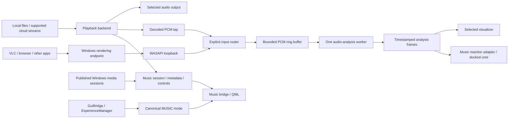

# E.V. Music mode — product and implementation roadmap

Date: 16 September 2026  
Status: Roadmap saved; Music mode implementation has not started.  
Requested deliverable: a project roadmap for a full music environment, local and cloud playback, visualization of other apps' audio, and a corner-docked E.V. core that reacts to music.

## 1. Product direction

Music mode becomes a complete listening workspace inside the existing E.V. app. The main canvas belongs to the music: album art, a chosen visualizer, track information and optional analysis instruments. The accepted golden E.V. core moves smoothly into a corner and responds to actual audio. Returning to Assistant restores its familiar position and appearance.

The player and visualizer have independent source selections. E.V. can play a local album, open supported cloud music, or simply visualize the sound already coming from VLC, YouTube in a browser, another player or a game. Entering Music mode does not automatically start another song over existing playback.

Recommended first experience: a dark gold music workspace, a responsive wide spectrum, a compact golden core, a persistent transport bar and an accessible library/queue. Add a preset gallery and studio analysis view on top of this working foundation.

### What the references contribute

| Reference | Direction for E.V. |
|---|---|
| Supplied desktop screenshot | Fine spectrum bars, edge waveforms, uncluttered dark space and modular panels. Apply these inside Music mode; the screenshot's desktop icons, clock, news and wallpaper are not a request to rebuild the Windows desktop. |
| FL Studio / Voxengo SPAN | A useful analysis workspace: logarithmic frequency axis, dBFS scale, adjustable FFT/smoothing, peak hold, stereo meters, precise cursor readouts and saved layouts. |
| Monstercat-style / MonsterCat-Visualizer | Strong rhythmic bars, mirrored arrangements, track identity and controlled color accents. |
| Cantarell, illustro, NR_Kantas, “Monster-” | Additional inspiration for minimal, modular and ornamental presentations. Exact versions/packages were not supplied; their particular behavior is not assumed or claimed to have been inspected. |
| Approved E.V. golden core | Preserve its sharp geometry, fire-gold highlights, stable silhouette and independent internal motion. Music adds deliberate reaction without repeating the rejected soft, elastic deformation. |

Build original Qt visuals inspired by these examples. Rainmeter skins and FL Studio plugins are not directly compatible with the current renderer. Loading third-party skins or hosting VST plugins is a separate extension, not a prerequisite for comparable visual variety.

## 2. Confirmed starting point

Inspected locally on 16 September 2026:

- `core/experience.py` already defines `EVExperienceMode.MUSIC`. `GuiBridge.setExperienceMode()` already routes a mode request through `EVExperienceManager`.
- `prototypes/cinematic_v4/qml/CinematicStage.qml` currently has a disabled `MUSIC · SOON` button. It has no player or music page.
- The production cinematic interface reuses `NucleusScene.qml`, `NucleusView.qml`, `CoreMotion.qml` and the connected presentation adapter. Approval and provider overlays already sit above the stage.
- Installed Qt/PySide6 is **6.11.2**. `QMediaPlayer.setAudioBufferOutput()` and `QAudioBufferOutput` are present. Qt documents the buffer tap as available since 6.8 and supported only by its FFmpeg backend.
- The repository currently allows `PySide6>=6.5.0`; that dependency declaration needs a tested minimum/version policy before releasing a feature that depends on newer APIs.
- NumPy and sounddevice are installed. Mutagen, SciPy, PyAudioWPatch, SoundCard and the top-level `winrt` package were not found. Qt WebEngine Quick is installed, but this does not prove any particular protected streaming service will work within it.
- The current machine is **Windows 10 Pro, build 19045**, with an **NVIDIA GTX 970**, plus integrated/virtual display adapters.
- The existing startup signature is independent presentation audio. It must not replay on every Music/Assistant tab switch.
- Current voice self-trigger protection checks the existing TTS manager. That is not a general guarantee against music from speakers triggering voice detection.

These are capability observations, not completed music playback, capture or performance tests. No dependency was installed and no system audio was captured for this roadmap.

## 3. The full player

### Library and organization

- Add files, selected folders and drag-and-drop tracks. Offer recursive import explicitly; do not scan every disk automatically.
- Library views for songs, albums, artists, folders, favorites and recently played items; fast search and sorting.
- Read tags, embedded album art, duration and codec information asynchronously. Use a bounded artwork cache and sensible missing-art placeholders.
- Maintain a SQLite music library and stable track IDs. Detect duplicate paths and handle moved, unavailable or deleted files without losing playlists.
- Create, rename, reorder and remove playlists. Import/export supported M3U/M3U8 playlists; distinguish an HLS stream manifest from a library playlist.
- Support cloud-synchronized folders when the files are available locally. Files that require OneDrive hydration must show a download/loading state rather than freeze the interface.
- Initial codec validation set: MP3, FLAC, WAV, AAC/M4A, Ogg Vorbis and Opus. Expand AIFF/WMA or other formats only after testing the shipped backend. Unsupported files show a useful error and can be skipped.
- Initial metadata work is read-only. Tag editing and writing album art into original files are later, explicit features.

### Transport and queue

- Play/pause, stop, previous/next, seek/scrub, elapsed/remaining time, mute, volume, output-device selection and keyboard/media-key support.
- Play now, play next, append to queue, reorder/remove queued tracks, clear queue, repeat off/one/all and predictable shuffle history.
- Keep queue identity stable when the library is sorted or filtered. Define previous-button behavior and avoid immediate shuffle repeats until the eligible queue is exhausted.
- Remember volume, device preference, queue and position. Default to restoring a paused session after app restart; automatic playback is an explicit preference.
- Continue playback while viewing Assistant or minimizing, when background playback is enabled. Suspend expensive visualization independently of playback.
- Show buffering, unavailable file, expired link, authentication, unsupported codec, network loss and device loss states. Do not display a running progress bar for failed playback.
- Optional sleep timer, stop-after-current-track and playback speed with capability-aware pitch compensation.

### Full player audio features

The complete local-player release includes tested gapless playback, optional crossfade, ReplayGain/normalization, a real equalizer with preamp/headroom, and independent visualization sensitivity. These are genuine audio features, not decorative sliders.

Important implementation decision: `QAudioBufferOutput` is an observation tap on decoded audio. Changing those buffers is not a supported way to apply an equalizer to `QMediaPlayer`'s already-running audio output. The initial Qt playback adapter gets a working player and analysis path quickly. The advanced-audio milestone must prove a processing-capable backend before enabling EQ, crossfade or gapless claims. Evaluate a bounded decoder → DSP → output pipeline, or an appropriate tested media backend with real audio filters. Keep the player UI behind an adapter so this does not require rebuilding the interface.

A ten-band EQ can be the first real EQ, followed by optional parametric controls. Provide safe preamp defaults, bypass, presets and audible verification. Sample-peak meters are sufficient initially; “true peak” or LUFS labels require the corresponding tested algorithms.

## 4. Audio from VLC, YouTube and other apps

Expose a clear **Visualizer input** selector:

| Input | Meaning | Expected behavior |
|---|---|---|
| E.V. player | Decode tap from the active E.V. playback backend | React only to E.V.'s track; exclude notifications and other apps. |
| Windows output | WASAPI loopback of the selected rendering endpoint | React to the audible mix on that device, including VLC/browser/other-app audio. No microphone required. |
| Follow playback | Resolve to the E.V. tap while E.V. is playing; otherwise the chosen Windows output | Display the actual selected input and switch with a short fade/analysis reset. Never combine both streams accidentally. |
| Specific application | Optional later capability | Requires a compatible OS/backend; unavailable by default on the current Windows build. |
| Microphone | Optional future opt-in | Separate from the voice-command pipeline and never the default substitute for output capture. |

### Windows constraints that affect the design

WASAPI endpoint loopback is the supported baseline for this PC. The Microsoft process-loopback sample requires **build 20348 or later**; the detected build **19045** does not meet that requirement. Do not promise an “only VLC” capture switch or exclusion of E.V.'s own audio on this machine using that API.

“All apps” means apps routed through the chosen endpoint. Audio sent to a different headset/interface is not included automatically. Add explicit device selection, follow-default-device behavior, endpoint-change detection and reconnect handling. Simultaneous multi-device capture is a later feature because those devices have different clocks and latency.

Protected paths, exclusive output and some driver configurations may not expose capturable samples. Show “No capturable audio on this device” with a source/device action, not fabricated meter movement. Opening Music mode should never install a virtual audio driver or reroute Windows audio silently.

Preferred first capture candidate: **PyAudioWPatch**, behind a small `SystemAudioSource` interface. Its published 0.2.12.8 release has CPython 3.12 Windows wheels, including amd64. This is evidence of package availability, not a passed capture test. Compare driver/device behavior on this PC during the first milestone; retain the ability to replace it with a small native WASAPI helper. Installed sounddevice alone is not evidence of a working loopback implementation.

Capture feeds analysis only. Do not send captured output back to speakers, create an echo path, save raw system audio or upload it. Keep a bounded in-memory buffer and release the device when visualization is disabled or Music mode no longer needs it.

### External track information and transport

Windows Global System Media Transport Controls can provide metadata and commands for applications that publish compatible sessions. It is a separate source from PCM capture: an FFT cannot reveal a reliable song title or which browser tab owns a sound.

Allow selection of an available media session and show supported play/pause/next/previous/seek commands. If VLC or a browser does not publish a useful session, keep audio visualization working with an honest source/device label. Never suggest that an external seek or volume control works when its session lacks the capability. External controls should target the selected session, not whichever app happens to receive a global media key.

## 5. Cloud music: supported paths and limits

“Cloud music” is a provider family, not one universal stream URL. Make each source expose capabilities such as play, seek, queue, metadata, artwork, download, PCM analysis, EQ and crossfade. The UI follows those capabilities.

| Source family | Planned support | Analysis/control boundary |
|---|---|---|
| OneDrive or other synchronized folders | Play user-selected files available on disk; handle hydration/offline failures | Same as local files once readable. No need to build account synchronization first. |
| Direct HTTP(S) music / internet radio | Saved stations/URLs, supported progressive streams; test HLS separately | Analyze decoded PCM when the backend supports it. Radio commonly has no seek or fixed duration. |
| Personal cloud library | Add one provider first, preferably a Subsonic-compatible server or Jellyfin; then consider WebDAV/cloud-drive APIs | Authenticate normally, fetch catalogs/stream URLs, refresh expiring links and respect the server's capabilities. |
| Music playing in an external browser/player | System-output visualization and optional published Windows media-session controls | E.V. observes the selected output; it does not become that provider's streaming client. |
| YouTube integration inside E.V. | Evaluate an official visible embedded player, with its own compatible layout | A YouTube page URL is not a direct audio file. Do not implement an invisible audio-only extractor/player. Validate platform policy and embedded-player behavior before shipping. |
| Spotify integration | Provider-specific feasibility milestone for supported control/metadata and, if permitted, playback | The Web Playback SDK requires eligible Premium access. Its SDK does not give E.V. an unrestricted PCM/DSP path. Current developer policy prohibits synchronizing recordings with visual media and mixing/overlapping Spotify content. A synchronized Spotify-platform visualizer, EQ or crossfade is therefore not part of the committed feature set without an authorized supported path. |
| Other commercial services | Separate adapters after the first provider works | Authentication, SDK availability, subscription/DRM rules and platform limits must be checked individually. |

A generic Windows-output visualizer and an official provider integration are distinct features. Do not use the former as an assumed workaround for a provider integration's restrictions. Verify the applicable terms again at implementation because they change.

Store credentials in Windows Credential Manager or an existing suitable protected store, not the library database, playlist export, QML or logs. OAuth should use the provider's supported desktop flow. Browser-engine presence alone does not establish protected-playback support. Offline downloads are available only for personal files or services that explicitly support them.

The first cloud milestone should deliver useful, testable support for synchronized folders, direct streams and one personal-library service. Spotify/YouTube work can proceed as separate adapters without delaying a reliable local player.

## 6. Music workspace and the core

### Default 1080p arrangement

```text
┌───────────────────────────────────────────────────────────────────────┐
│ E.V.   Assistant | Music         Input: Windows output   Device   Gear │
├──────────────┬───────────────────────────────────────────┬────────────┤
│ Library      │ Track / artist / source                   │ Queue      │
│ Albums       │                                           │ Play next  │
│ Artists      │          MAIN VISUALIZER CANVAS           │ Upcoming   │
│ Playlists    │                                           │            │
│ Cloud        │ Spectrum / artwork / cinematic scene      │ Small core │
│ Radio        │                                           │ in dock    │
├──────────────┴───────────────────────────────────────────┴────────────┤
│ Art  Track     Previous  Play/Pause  Next     Seek      Volume  Repeat │
└───────────────────────────────────────────────────────────────────────┘
```

Starting dimensions, to be tuned after rendering: navigation 200–240 px, collapsible queue 260–300 px, transport 88–104 px and a 160–210 px core dock. Default core position is lower-right above the transport. Let the user choose a corner and save that preference. On smaller windows, use drawers and a 110–140 px core; avoid shrinking transport controls until they become unusable.

Offer four workspace layouts using the same playback session:

1. **Player:** library, art, queue and a restrained visualizer.
2. **Visualizer:** large scene, compact controls and the corner core.
3. **Studio:** spectrum, waveform, meters and analysis controls.
4. **Immersive:** fullscreen scene with controls that reappear on pointer/keyboard input; Esc always exits. A desktop overlay is a separate future option, not part of the existing in-window transparency behavior.

Move the existing core into its dock with a roughly 550–800 ms position/scale transition. Reuse one renderer where practical; do not render a hidden full-size core as well as a visible miniature. Size its offscreen textures and glow work for its docked dimensions. Avoid changing QML parenting/render surfaces mid-frame without testing; a shared stage-owned core with animated geometry is a good first approach.

Opening Music mode must not play the app's startup announcement again. Switching back to Assistant restores the accepted core pose/size and retains the music queue. Decide continued playback through an explicit background-playback preference, not by accidental widget lifetime.

### How the core “dances”

| Audio feature | Proposed visible response |
|---|---|
| Bass envelope | Small, bounded energy/brightness pulse; optional scale excursion around 1–2%, separately disableable. |
| Transient/onset | A short local glint or discharge with a cooldown; no sustained flash on every sample. |
| Midrange energy | Increase internal ribbon/current activity. |
| High-frequency energy | Fine particle sparkle and short emission tails. |
| Slow energy / beat confidence | Smoothly vary bounded internal orbital speed and tilt. Do not snap rotation phase. |
| Stereo balance | Subtle left/right energy bias within the core. |
| Silence, pause, missing source | Release to calm idle; no synthetic dancing presented as measured audio. |

Preserve the recognizable sphere, crisp strands and golden/fire palette. Do not turn it into a soft blob, bounce the entire dock around the screen or let particles cover controls. Offer Calm / Responsive / Energetic intensity and a reduced-motion setting. Musical BPM is an estimate; hide it or mark uncertainty when beat confidence is low.

Voice/assistant/approval signals retain priority over decorative music reaction. Use real music metrics through a presentation adapter; do not set the canonical assistant state to `SPEAKING` just because a song plays. Approval overlays keep their current top-level ownership, and heavy effects may dim/pause while approval is visible.

## 7. Visualizer gallery

Every preset reads the same timestamped analysis frame. It must not open its own audio device or run another FFT. Presets expose palette, intensity, smoothing and layout settings while sharing a consistent settings surface.

| Preset | Appearance and controls | Delivery |
|---|---|---|
| Studio Spectrum | SPAN-inspired log-frequency spectrum, dBFS axis, peak hold, average/instant curves, cursor Hz/dB and FFT options | First working release |
| Golden Skyline | Classic responsive bars, selectable count, rounded/sharp caps and golden highlights | First working release |
| Mirror Pulse | Mirrored bars from a central axis, selectable horizontal/vertical direction | First working release |
| Edge Line | Thin waveform or spectrum strip around a chosen edge; quiet and minimal | First working release |
| Radial Halo | Circular spectrum around artwork or a separate central void, keeping the core in its dock | Visual gallery milestone |
| Ribbon Flow | Smooth flowing waveform trails with bounded persistence and stereo separation | Visual gallery milestone |
| Stereo Scope | Left/right waveforms, Lissajous/goniometer and correlation display | Studio expansion |
| Spectral Waterfall | Time/frequency spectrogram with log-frequency mapping and adjustable history | Studio expansion |
| Particle Field | Measured energy drives small bursts and flowing particles in depth | Cinematic expansion |
| Energy Tunnel | Restrained forward motion and bass-driven rings; reduced-motion alternative | Cinematic expansion |
| Album Atmosphere | Artwork-led composition with extracted palette, soft background and fine reactive accents | Visual gallery milestone |
| Modular Desk | Resizable combination of spectrum, small meters, waveform and art, inspired by desktop widget layouts | Polished release |

Start with four excellent presets. Expand to at least eight stable presets before calling the gallery complete; target all twelve after performance and visual review. User references are a starting set, not a cap on future preset options.

Studio controls: FFT size, overlap, display frequency range, window choice, peak hold/decay, averaging, smoothing and display slope. Aesthetic display slope must not silently alter measurement readouts. Label RMS, sample peak and correlation accurately. Add calibrated loudness measurements only with a validated implementation.

Preset transitions should last about 250–450 ms. On weaker hardware, fade out then load/fade in instead of rendering two expensive scenes concurrently. Save per-preset customization and provide Reset preset. Later preset import/export should use a validated declarative schema, not execute downloaded scripts.

## 8. Audio analysis and rendering architecture



### Ownership and interfaces

- `MusicSession` owns music-domain playback, queue and source state. It does not duplicate assistant lifecycle/approval state.
- `PlaybackBackend` provides load/play/pause/seek/device/error/capability operations. `QtPlaybackBackend` is the first adapter; real DSP features can use another adapter after the audio-engine milestone.
- `SystemAudioSource` owns one selected loopback capture client and its reconnect lifecycle.
- `AudioInputRouter` chooses one analysis stream and tags it with source ID, sample rate, channels, timestamp and discontinuity/epoch. Never accidentally analyze both a track's decode tap and its loopback copy.
- `AudioAnalysisWorker` emits immutable bounded snapshots: spectrum bands, waveform display points, stereo RMS/sample peak, bass/mid/treble energy, onset, silence state, optional beat estimate/confidence and timing.
- `MusicBridge` exposes those domain properties/actions to QML. Requests to change experience mode still go through the existing `GuiBridge`/`EVExperienceManager` path.
- `MusicVisualAdapter` maps metrics to the accepted core's bounded presentation parameters without rewriting its meshes or assistant state machine.
- External metadata/transport is an optional `WindowsMediaSessionAdapter`; source metadata availability never determines whether loopback can visualize audio.

### Processing and synchronization

- Respect actual device format; support at least stereo 44.1/48 kHz and handle channel/sample-format changes. Use a deliberate normalized internal PCM format.
- Start live analysis with a Hann window, a 2048-sample FFT and an approximately 512-sample hop at 48 kHz. This is a starting configuration, not a benchmark result.
- Studio low-frequency inspection can use 4096/8192 samples with the visible latency/resolution tradeoff explained. At 48 kHz, 2048 samples span about 42.7 ms and 4096 span about 85.3 ms; capture/output/transport latency adds to this.
- Group bins logarithmically for decorative bars while retaining appropriate calibrated data for studio readouts. Normalize FFT/window gain correctly and handle stereo cancellation deliberately rather than blindly summing channels.
- Use attack/release envelopes, spectral flux/onset detection, noise-floor tracking and confidence-aware beat estimation. Silence should not be amplified into a constantly active animation.
- Qt emits decoded buffers near the point where it pushes data to output; its documentation explicitly notes output buffering delay. Measure synchronization rather than assuming callback time equals audible time. Rate changes, seeks and buffering need timestamp/epoch resets.
- Separate sound volume, analyzer reference level and visual gain. Specify whether a meter is pre- or post-volume. By default the decorative core follows audible intensity, including mute; do not claim raw decoded PCM is post-volume measurement.
- Keep capture callbacks short: copy to a bounded buffer, timestamp and return. No FFT, artwork, file I/O, logging loops or Qt scene mutation in the callback.
- A worker performs analysis. The GUI consumes the newest useful frame at its render cadence, drops stale display frames and interpolates motion. Playback must not wait for the visualizer.
- Flush old waveform/FFT state on seek, input/device change and track discontinuity; decay gracefully on loss. Bounded queues prevent an ever-growing delay.
- Raw captured system audio remains transient in memory. Persist settings/library metadata, not a listening recording.

### Rendering approach

Keep the existing Qt Quick/Qt Quick 3D/D3D11 stack. Use batched scene-graph geometry or ShaderEffect renderers for bars and waveforms, small GPU data textures for spectra, and a bounded texture history for spectrograms. Avoid thousands of QML objects or CPU-painted full-window canvases on each frame. Prototype a simple implementation first and promote hot paths only after measuring them.

Keep the small core's geometry/settings shared with Assistant while allowing a dock-size detail profile. Never alter the approved Assistant look to make Music mode fit a performance target. Reduce music preset cost, dock rendering resolution and optional glow first.

## 9. Performance and quality targets

These are acceptance targets to measure, not present results or guarantees:

| Area | Standard | Quality / lighter |
|---|---|---|
| Render target | 60 FPS on an exposed 1080p 60 Hz window where hardware permits | 30 FPS with materially less visual work |
| Decorative bands | Typically 64–128; allow 256 only if measured useful | Typically 32–64 |
| Spectrogram/history | Moderate resolution/history, bounded allocation | Shorter history and smaller textures |
| Cinematic particles | Preset-specific measured budget | Approximately one-third to one-half standard density |
| Core dock | Size-appropriate render target and glow | Lower detail/resolution and fewer glow samples |
| Analysis scheduling | Keep input cadence sufficient for useful transients | Reduce display publication/optional processing, not playback reliability |
| Interaction latency | Aim for visible reaction within roughly 50–120 ms for responsive presets; report measured endpoint/backend results | Comparable responsiveness where possible; prioritize lighter effects |

Aim for no audio underruns/dropouts during a 30-minute representative playback run, bounded memory during a two-hour soak, and stable task/approval interactions while music plays. Profile actual CPU/GPU/VRAM use with the core, visualizer and voice workloads together. The GTX 970's roughly 4 GB VRAM budget argues against stacking multiple full-resolution blur/render surfaces.

Use render frame-time distributions, callback/analysis duration, buffer-drop counts and measured input-to-visual delay. Keep FFT size and onset behavior documented for each measurement. Do not describe average RMS as exact beat tracking.

Verify 60 FPS on a physical or otherwise confirmed 60 Hz display. The previous virtual/remote display could run at 32 Hz; forced readback captures and encoded preview videos are not valid live-FPS benchmarks. Quality mode must demonstrably reduce work, not merely sleep between unchanged frames.

## 10. Voice, assistant and overlay coexistence

- Ordinary music transport never grants execution/approval authority. A provider connection or music command must not bypass existing command/approval ownership.
- During an existing approval, keep its current z-order, keyboard ownership and resolution path. Music controls cannot receive input through it.
- Duck or pause **E.V.-owned** playback for assistant speech only when the feature is enabled, then restore the prior user volume. Do not alter other applications' volume without a specific supported user-selected control.
- Distinguish analyzing music from recognizing speech. Loopback must never be routed into the ASR/command recognizer as if it were microphone input.
- Test speakers/headphones and false wake behavior. Existing suppression during TTS does not solve acoustic feedback from a song. Any needed changes to voice capture/recognition require their own scoped work.
- Preserve the user's earlier requirement: edits to `core/tts.py` or a PCM TTS redesign need separate explicit authorization. They are not required to deliver local playback and visualizers and are not silently bundled into this roadmap.
- Music voice commands come after the playback API is stable. Route them through the existing intent/command path; do not have visualizer callbacks execute commands.

## 11. Delivery milestones and acceptance gates

| Milestone | Deliverable | Exit evidence |
|---|---|---|
| M0 — Audio feasibility and baseline | Backup accepted source; validate Qt decode tap, WASAPI candidate, output switching, supported codec set and source routing on this PC. Confirm advanced DSP backend direction. | Local track produces real samples; VLC and browser audio on the selected endpoint produce real samples; pause/silence settles; no loopback-to-speaker echo; no writes to user music. Record OS/backend/device facts. |
| M1 — Music shell and core dock | Enable canonical Music navigation; add workspace/transport layout and animated corner dock; preserve Assistant restoration and overlays. | Keyboard/mouse checks at 1100×760, 1280×720 where supported, 1920×1080 and fullscreen; no duplicate heavyweight core render; startup announcement plays only at app launch. |
| M2 — Working local player | File/folder import, metadata/art, queue, playback/seek/device controls, saved paused session and useful errors. | Codec fixtures, missing/corrupt file behavior, queue/shuffle/repeat correctness, restart recovery and background playback. |
| M3 — Shared analysis and first visuals | One DSP path, input selector, real spectrum/waveform/meters, four initial presets and restrained corner-core reaction. | Known tones, stereo signals, impulses and silence verify frequency/channel/envelope behavior. Visible reaction to E.V., VLC and browser playback; no fake activity during silence. User visual review. |
| M4 — Complete local audio features | Prove and implement real EQ/preamp, normalization, gapless/crossfade where supported, media keys and sleep timer. | Audible/numerical EQ test, headroom check, gapless boundary/crossfade tests, no double output and no unsupported controls enabled. |
| M5 — Visual gallery and studio | Eight stable presets minimum, progressing to twelve; preset controls, studio spectrum/scope/spectrogram and saved workspace layouts. | Same-source consistency, calibrated analyzer checks, transitions/reduced motion, side-by-side reference review and profile measurements. |
| M6 — Cloud release | Synchronized-folder behavior, direct streams/radio and one personal-cloud adapter, with credentials and capability-driven UI. | Buffering/reconnect/seek/live-stream tests, expired login/link handling, offline state, bounded cache and accurate feature availability. |
| M7 — External sessions and provider expansion | Windows media-session metadata/control; separately evaluate YouTube/Spotify and additional providers. | Per-app/per-provider matrix with actual supported commands, account/environment restrictions and explicit unavailable states. No universal-cloud claims. |
| M8 — Coexistence, polish and release | Voice/assistant behavior, performance profiles, accessibility, long-session stability, dependency/packaging and rollback documentation. | Existing bridge/approval/startup checks pass; physical-display performance results, audio soak results, user acceptance and a restorable release snapshot. |

Implement in that order, with some UI/gallery design work possible after M0. Do not spend the first iteration polishing twelve effects before source capture and playback have been proven.

Reviewable checkpoints: M1 layout/core dock; M3 first real reactive experience; M5 gallery and studio design; M6 cloud workflows; M8 release acceptance. Before each implementation batch, create a scoped backup or commit without overwriting unrelated working-tree changes. Preserve a known working local-player build as cloud features are added.

## 12. Proposed project layout

These are proposed paths, not files created by this planning task. Reuse established project conventions if implementation review suggests a better location.

```text
music/
  models.py                 # capabilities, track, queue and analysis contracts
  session.py                # one music-domain session
  library.py                # SQLite library, playlists and import jobs
  playback/base.py           # playback adapter contract
  playback/qt_backend.py     # initial Qt/FFmpeg player and decode tap
  audio/system_loopback.py   # replaceable Windows capture adapter
  audio/input_router.py     # source selection, timestamps and discontinuities
  audio/analysis.py          # FFT, envelopes, peaks and onset/beat confidence
  providers/                # personal cloud, radio and later service adapters
  windows_media_sessions.py # metadata / capability-aware external controls
gui/music_bridge.py         # QML-facing music session, no approval authority
prototypes/cinematic_v4/qml/music/
  MusicWorkspace.qml
  TransportBar.qml
  LibraryPanel.qml
  QueuePanel.qml
  VisualizerHost.qml
  PresetGallery.qml
  StudioPanel.qml
  visualizers/              # shared render contracts and original presets
tests/music/                # meaningful playback, DSP and session tests
docs/reports/               # milestone evidence and measured limitations
```

Persist the music database/settings/cache under a dedicated user app-data directory, not alongside source or original music files. Define migrations, cache size limits and safe import/export behavior. Keep secrets separate. Decide exact app-data identity and packaging paths in M0.

## 13. Verification matrix

- **DSP fixtures:** known-frequency tones, stereo-only channels, anti-phase stereo, bass impulses, sweeps, quiet passages and silence. Assert analyzer calibration and stable release instead of checking only that bars move.
- **Playback:** paused seeks, seek during buffering, track end, rapid skip, repeat-one, shuffled history, different sample rates, unavailable output and restart recovery. Gapless/crossfade/EQ require backend-specific evidence.
- **Output capture:** VLC, YouTube in a browser, a second player, notifications, device switching, headphones/Bluetooth if available, remote-audio changes and an endpoint with no signal. Note exactly which endpoint and session were tested.
- **Cloud:** direct file versus live radio, unavailable host, expired URLs/tokens, interrupted buffering, provider capability differences and cloud placeholders not yet downloaded.
- **UI:** narrow/fullscreen layouts, readable album/track names, keyboard-only transport, visible focus, high-DPI scaling, core docking/restoration and no overlays intercepting the approval surface incorrectly.
- **Coexistence:** startup signature, Assistant return, task execution state, approval, TTS enabled/disabled and voice idle/listening. Do not claim real voice coexistence based only on simulated levels.
- **Performance:** standard and lighter profiles, each heavy preset separately, 30-minute audio reliability and two-hour bounded-memory soak. Run sustained tests only during an authorized implementation/testing session, not as an implied background promise from this roadmap.

## 14. Scope, estimates and decisions

The roadmap covers the requested complete product; delivery is incremental. A working preview is not described as the finished full-function player.

Rough planning range, assuming local dependencies and capture behave normally: a first useful local player with output-reactive visuals and the docked core in **about 5–8 focused engineering days**; a polished local/personal-cloud release with the wider gallery and stability work in **about 3–6 working weeks**. These are effort estimates, not a promise of unattended elapsed time. Advanced audio-engine work or commercial-provider approval/SDK constraints can extend the range. Re-estimate after M0 using actual capture, codec and DSP results.

Defaults chosen so the plan is actionable: lower-right core, fire-gold theme, four initial presets, local files plus Windows output first, personal cloud/direct streams before commercial integrations, no microphone capture by default, and one shared analysis engine. The user can refine the defaults at visual checkpoints.

Decisions for their relevant milestone: first personal-cloud service/account, preferred commercial services, exact skin versions if close matching is wanted, EQ/gapless backend, core intensity, library scale and whether microphone input, desktop overlays or third-party VST hosting belong in a later extension. None is required to finish this planning deliverable.

## 15. Technical sources checked

Accessed 16 September 2026. Online documentation can change; recheck provider restrictions before implementation.

1. Qt QAudioBufferOutput: https://doc.qt.io/qt-6/qaudiobufferoutput.html — decoded PCM for analysis; FFmpeg backend requirement.
2. Qt QMediaPlayer: https://doc.qt.io/qt-6/qmediaplayer.html — API availability, buffering timing and playback-rate caveats.
3. Microsoft WASAPI loopback: https://learn.microsoft.com/en-us/windows/win32/coreaudio/loopback-recording — capture of the selected rendering endpoint/system mix.
4. Microsoft application loopback sample: https://learn.microsoft.com/en-us/samples/microsoft/windows-classic-samples/applicationloopbackaudio-sample/ — process-tree capture and build 20348 minimum for that approach.
5. Windows media sessions: https://learn.microsoft.com/en-us/uwp/api/windows.media.control.globalsystemmediatransportcontrolssessionmanager?view=winrt-26100 — metadata/control only for participating sessions.
6. PyAudioWPatch release metadata: https://pypi.org/pypi/PyAudioWPatch/json — 0.2.12.8 Windows Python 3.12 wheel availability; capture is not yet tested locally.
7. Rainmeter AudioLevel: https://docs.rainmeter.net/manual/plugins/audiolevel/ — endpoint WASAPI analysis shared across multiple meters, a useful architectural reference.
8. Voxengo SPAN: https://www.voxengo.com/product/span/ — FFT, window/overlap, slope and peak/smoothing controls as studio-analysis inspiration.
9. Spotify Web Playback SDK: https://developer.spotify.com/documentation/web-playback-sdk — account/playback requirements.
10. Spotify Developer Policy: https://developer.spotify.com/policy — visual synchronization and mixing restrictions affecting a provider-specific integration.
11. YouTube IFrame API: https://developers.google.com/youtube/iframe_api_reference — official embedded player behavior.
12. YouTube Developer Policies: https://developers.google.com/youtube/terms/developer-policies — separation/modification of audio/video and hidden background-player restrictions.

The attached screenshot and named products are design references. They are not instructions to install skins/plugins, alter the desktop, copy a wallpaper, change accounts or bypass provider limitations. Only this roadmap document was created for the present request.
